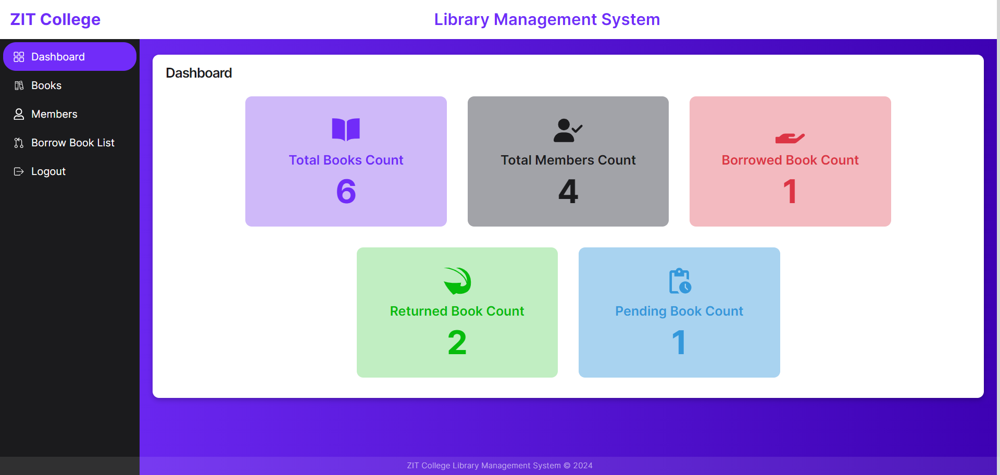
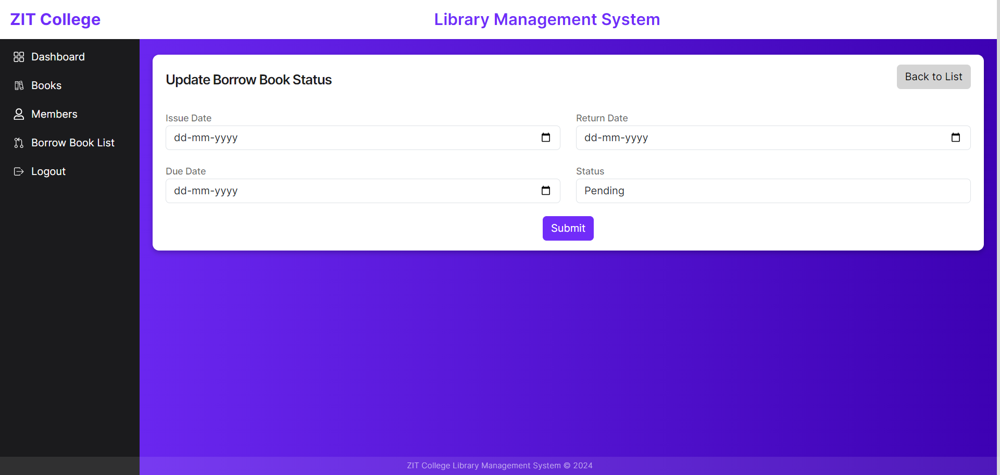

# CollegeManagementSystem

College Library Management System

Admin Login with email and password

Users can borrow books at that time status will be pending. Admin will update the book status as approved along with the issue date and duedate.
User can update return date when return and they have to change the returned status. user cant edit issue and due date.

User Login with email and phone number

Users can change the approved book status

Mobile View Screenshots

